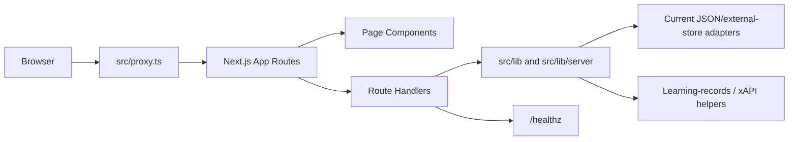
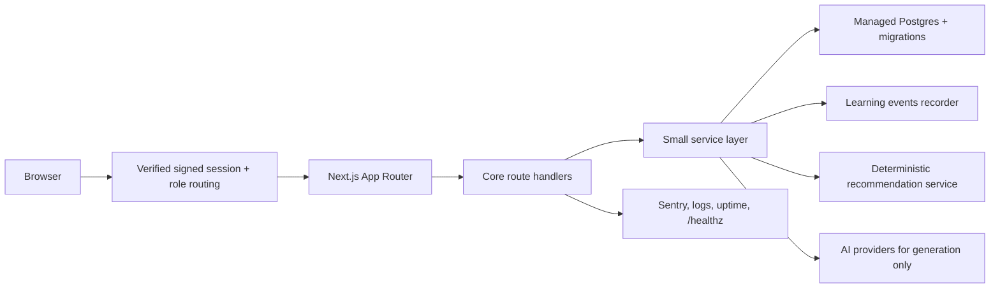

# UAIS Architecture Map

This is the one-page small-team map requested by the technical advisory. It
describes the current proof of concept and the near-term target; it is not an
enterprise architecture.

## Core POC Scope

Keep active development focused on:

- Course plaza: `/courses`
- Learner workspace: `/learning`
- Human-AI chatroom: `/learning/chatroom`
- Student dashboard: `/student-dashboard`
- Teacher workspace: `/teaching`
- Login and app session: `/login`, `/api/auth/app-session`, `src/proxy.ts`
- Basic liveness: `/healthz`
- Privacy Baseline: `docs/privacy-baseline.md`, `/privacy`, `/terms`

Park or quarantine new investment in voice clone, PPT narration, enterprise
evidence gates, restore-drill ceremony, and retention-readiness modules until
the core foundations are safe.

## Runtime Flow

## Current Boundaries

| Area | Current files | Current risk |
| --- | --- | --- |
| App shell and routes | `src/app/`, `src/components/layout/` | Route auth depends on signed-session validation and proxy behavior. |
| Page UI | `src/components/pages/` | Large client files mix rendering and workflow logic. |
| Data and copy | `src/data/uais.ts`, `src/i18n/copy.ts` | Mock data remains the core product source. |
| Auth | `src/lib/server/uais-app-session.ts`, `src/lib/server/uais-app-auth-provider.ts`, `src/proxy.ts` | Local demo accounts are acceptable only outside production. |
| Teaching storage | `src/lib/server/teaching-*store.ts` | JSON/file-style persistence is not a managed system of record. |
| Core database | `src/lib/db/schema.ts`, `migrations/0001_core_poc.sql`, `scripts/apply-core-migrations.mjs` | B-11 Drizzle/Postgres baseline exists; live provider, credentials, staging proof, and normalized-table cutover remain blocked. |
| Teaching course Postgres seam | `src/lib/server/teaching-course-management-postgres-store.ts` | Transitional durable snapshot adapter behind the existing repository interface; use only with approved `UAIS_CORE_DATABASE_URL`. |
| Learning records | `src/lib/learning-records/` | Useful analytics signal, but not an application database. |
| Learner profiles | `src/lib/learning-records/learner-profile.ts`, `docs/learner-profiles.md` | B-17 queryable profile projection over xAPI evidence; DB persistence still depends on B-11/B-12. |
| Adaptive recommendations | `src/lib/adaptive-learning/recommendations.ts`, `docs/adaptive-recommendations.md` | Deterministic B-18 foundation only; persistence and production thresholds still need owner/S12/S22 decisions. |
| AI orchestration | `src/lib/ai/` | Keep providers behind server-side interfaces; do not make LLM output the system of record. |
| Privacy baseline | `docs/privacy-baseline.md`, `src/app/privacy/page.tsx`, `src/app/terms/page.tsx` | Retention, deletion, provider-processing, and incident-contact choices must be approved before real student cohorts. |
| Observability | `src/instrumentation.ts`, `src/instrumentation-client.ts`, `src/sentry.*.config.ts`, `/healthz` | Sentry and external uptime are wired, but real DSN/token/provider values remain deployment-lane configuration. |
| Deployment lanes | `docs/runbooks/staging-preview.md`, `src/lib/release/deployment-lanes.ts` | Production promotion is blocked until preview and staging evidence exist for the same release slice. |

## Near-Term Target

## Minimal Data Model To Review

See `docs/core-schema-design.md` for the expanded B-10 schema draft, B-11
Drizzle/Postgres baseline, and migration order.

- `users`: id, account, hashed_password, role, display_name, department, created_at
- `courses`: id, title, description, teacher_id, status
- `lessons`: id, course_id, title, order, content_ref
- `enrollments`: id, user_id, course_id, state, progress
- `assessments`: id, lesson_id, type
- `submissions`: id, assessment_id, user_id, score, submitted_at
- `learning_events`: id, user_id, course_id, verb, object, timestamp
- `learner_profiles`: user_id, mastery, preferences, updated_at
- `recommendations`: id, user_id, next_lesson_id, rationale, created_at

## Migration Rule

Use expand, migrate, contract:

1. Add the managed database adapter behind the existing storage boundary.
2. Dual-write or backfill one entity at a time.
3. Verify parity in staging.
4. Switch reads after parity is proven.
5. Remove the old JSON/file path only after a rollback path exists.

## Critical Flow Tests To Build

CI should eventually block merges that break:

- Login and first protected-page redirect.
- Student enrollment or invite join.
- Learner playback and progress event recording.
- Chatroom message and export/share path.
- Teacher course create/read/update path.
