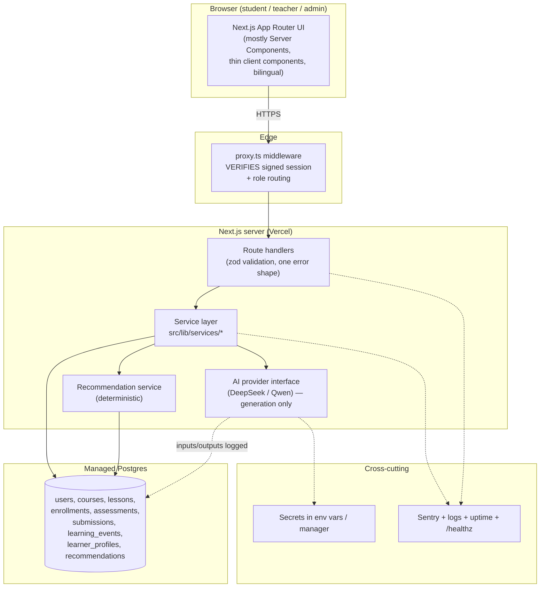
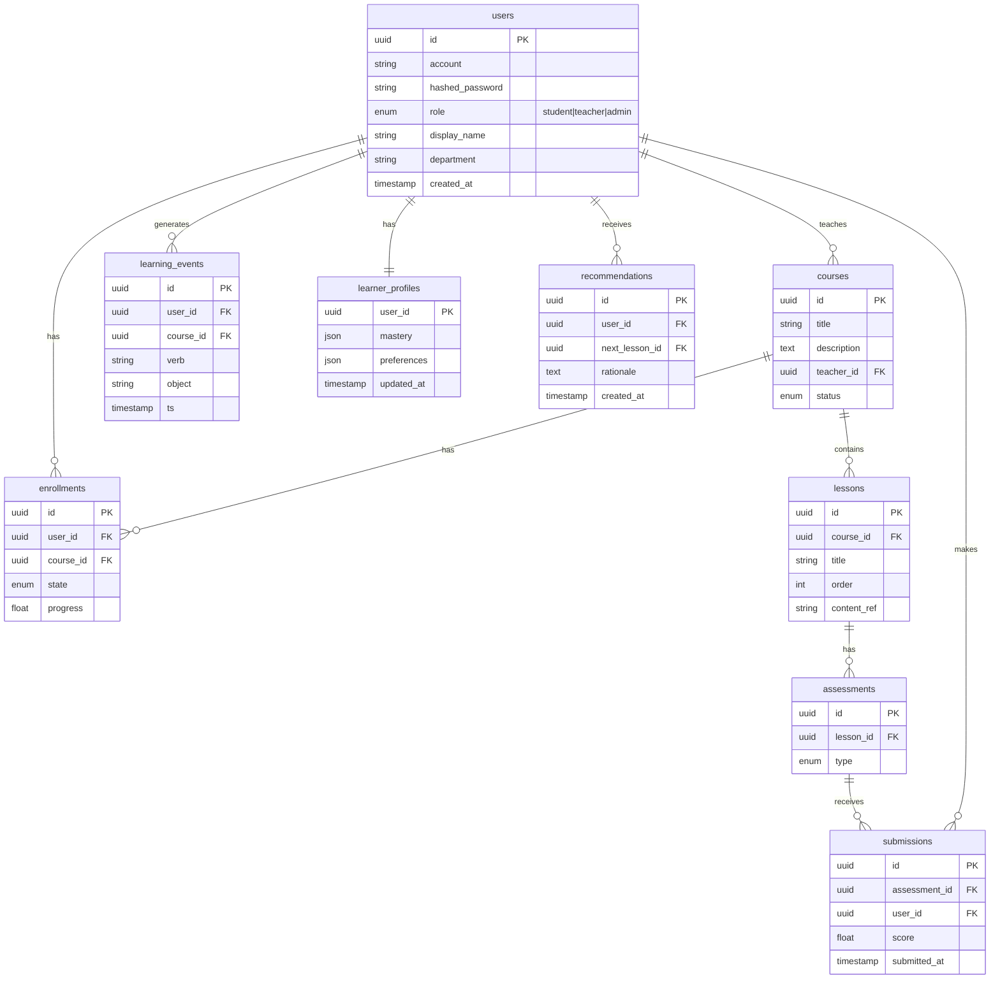

# UAIS — Recommended Near-Term Target Architecture

**Companion to** `UAIS_Senior_Technical_Advisory_Report.docx` (Section E).
**Audience:** the junior developer maintaining UAIS and any future engineers.
**Principle:** the smallest architecture that supports students, teachers, admins, content, assessments, progress tracking, adaptive recommendations, analytics, and secure deployment — **without** enterprise over-engineering.

---

## 1. What stays, what changes

| Layer | Keep / Change | Recommendation |
|---|---|---|
| Frontend | **Keep** | Next.js App Router + React 19 + Tailwind v4. Move heavy logic into Server Components; keep client components thin and presentational. Keep the bilingual i18n module (zh-CN default) as-is. |
| Authentication | **Change** | **One** signed-session model (httpOnly, Secure, SameSite=Lax) with hashed passwords via a real provider (the existing trusted-account provider, or Auth.js). Roles: `student`, `teacher`, `admin`. Middleware verifies the **signature**, never mere cookie presence. |
| Backend / API | **Simplify** | Next route handlers → a small service layer in `src/lib/services`. One shared `zod` validator and one error shape. Park non-core routes. |
| Data | **Add (this is the big one)** | Managed Postgres (Neon / Supabase / Vercel Postgres) + Prisma or Drizzle + migrations in git. Introduce it **behind the existing storage-contract abstraction** so pages don't change. Core entities only. |
| AI / adaptive | **Restructure** | LLM providers (DeepSeek, Qwen) behind the existing provider interface, used for **generation**. A small **deterministic** recommendation service reads learner data from Postgres. All AI input/output logged for evaluation. Secrets server-side only. |
| Observability | **Add** | Vercel Analytics + Sentry + structured server logs + external uptime check + a generalized `/healthz`. |
| Deployment | **Add lanes** | Vercel: Preview (per PR) → Staging (own DB/secrets) → Production. Documented rollback. |
| Experimental | **Quarantine** | Voice-clone, PPT-narration, enterprise audit/evidence modules kept clearly separate under `experimental/` until there is a real need. |

---

## 2. System diagram

---

## 3. Minimal data model

Enough to run the product and support adaptivity — and no more.

**Notes**
- `learning_events` is **xAPI-shaped** — the existing event helpers already produce this shape, so it is the natural raw signal for both analytics and adaptivity.
- The **LLM is never the system of record.** It generates content/feedback; the database holds truth; the recommendation service is deterministic and reproducible from stored data.
- Store the **minimum** student PII needed. Define retention and deletion up front (see readiness checklist).

---

## 4. How to get here without breaking the live site

1. Implement a **real DB adapter behind the current storage-contract** interface. Call sites don't change.
2. Migrate one entity at a time using **expand → migrate → contract**: add the new store, dual-write / backfill, verify parity, then remove the old file/JSON path.
3. Do it all on **branches with Preview deploys**, validated on **staging** before production.
4. Land the **five critical-flow tests** (login, enrol, learn, chat, teacher CRUD) *before* the big refactors so regressions are caught immediately.
5. Never mix a refactor and a behavior change in the same pull request.

See the roadmap and backlog in `UAIS_Issue_Register_and_Backlog.xlsx` for the sequenced tickets (B-10 → B-11 → B-12 build this out).
